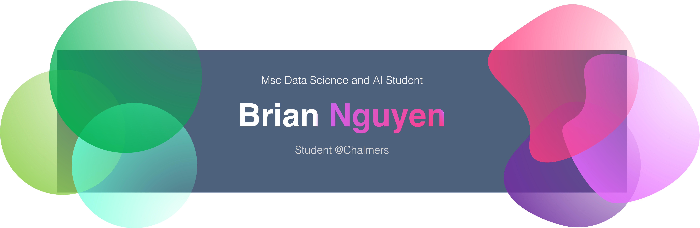

<h1 align="center">Hello! 👋 I'm Brian</h1>
<h3 align="center">A CS student at Chalmers University in Sweden</h3>
<h3 align="left">Summary</h3>

 <a>
Hi! 👋 My name is Brian, and I’m a Computer Engineering student at Chalmers University of Technology.

Throughout my studies, I’ve built a strong foundation in programming, system development, machine learning, databases, and statistics.

Alongside my studies, I’ve worked with applied machine learning and big data, and I’ve developed production systems powered by large language models (LLMs). I also work part-time as a Head Developer, which provides me with valuable hands-on experience in leading development projects and bridging theory with practice.

I’m currently pursuing an MSc in Data Science and AI, further deepening my expertise in this exciting field.
</a>

<h3 align="left">Connect with me:</h3>

